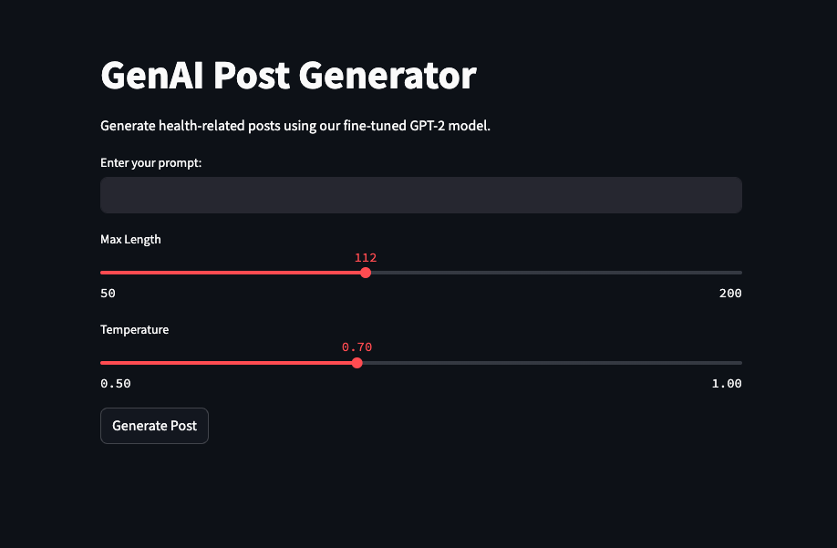

# GenAI Post Generator – Health Domain

*A comprehensive solution that generates health-related posts using a fine-tuned GPT-2 model, containerized with Docker, and automated via CI/CD.*

---

## Project Overview

Modern healthcare communication requires generating accurate, domain-specific content that engages and educates. The **GenAI Post Generator** tackles this challenge by fine-tuning GPT-2 on health news data, deploying the model through a FastAPI application, and offering a user-friendly Streamlit interface. A robust CI/CD pipeline with Docker and GitHub Actions ensures seamless integration and deployment.

---

## Data Story

### Aim & Goal

- **Aim:**  
  Develop a data-driven system capable of generating coherent and useful health-related posts.

- **Goal:**  
  Transform raw health news data into a specialized GPT-2 model for real-time text generation, backed by a scalable, containerized infrastructure and automated deployment.

### Problem Statement

Traditional content generation systems often fail to capture the nuances and terminology specific to the health domain. Our project addresses this gap by leveraging advanced NLP techniques (GPT-2 fine-tuning) and domain-specific datasets (health news) to produce more accurate and contextually relevant text.

### Our Approach

1. **Data Ingestion & ETL:**  
   - **Raw Data Ingestion:** Download a health news dataset from Kaggle.  
   - **ETL Process:** Clean and preprocess the data to create a processed CSV file for training.

2. **Model Fine-Tuning:**  
   - **Fine-Tune GPT-2:** Adapt GPT-2 to health-related content by training on the processed dataset.  
   - **Model Output:** Save the fine-tuned model and tokenizer for subsequent usage.

3. **API Development:**  
   - **FastAPI Application:** Provide a `/generate` endpoint to serve the model for generating health-related posts.  
   - **Integration:** The API loads the fine-tuned GPT-2 model at runtime.

4. **Web Interface:**  
   - **Streamlit App:** An interactive UI where users can enter prompts, adjust parameters, and view generated health posts in real time.

5. **Containerization & CI/CD:**  
   - **Docker:** Containerize the FastAPI application for consistent deployment.  
   - **GitHub Actions:** Automate testing, building, and verifying the Docker container on every push or pull request.

---

## Workflow Diagram

Below is the **Workflow Diagram** illustrating each stage—from data ingestion and ETL to containerized deployment and user interaction:


1. **Data Ingestion & ETL:**  
   - Download the health news dataset from Kaggle.  
   - Clean, preprocess, and output a processed CSV file.

2. **Model Fine-Tuning:**  
   - Use the processed CSV to train and adapt GPT-2 to health content.  
   - Save the resulting model and tokenizer.

3. **Containerization & CI/CD:**  
   - Containerize the FastAPI app with Docker.  
   - Use GitHub Actions to build, test, and verify the container automatically.

4. **API Development:**  
   - Build the FastAPI application to load the fine-tuned model.  
   - Provide endpoints for text generation.

5. **Web Interface:**  
   - Create a Streamlit app that communicates with the API to generate posts.

---

## Key Skills & Technologies

- **Data Engineering & ETL:** Parsing and cleaning health news data.  
- **NLP & Model Fine-Tuning:** Adapting GPT-2 for domain-specific text generation.  
- **API Development:** Using FastAPI to serve the model.  
- **Containerization:** Building Docker images for consistent deployment.  
- **CI/CD:** Automating tests and builds with GitHub Actions.  
- **User Interface:** Providing an interactive Streamlit app for real-time content generation.

---
## How the Streamlit App Works

Below is a screenshot of the **Streamlit app**:



1. **Prompt Input:**  
   - Enter a health-related query or prompt (e.g., “How can I maintain a healthy lifestyle?”).  
   - This prompt is sent to the `/generate` endpoint in our FastAPI application.

2. **Max Length Slider:**  
   - Controls the maximum token length of the generated text.  
   - Increasing this value allows for more detailed responses, while a lower value keeps outputs concise.

3. **Temperature Slider:**  
   - Adjusts the creativity or randomness of the generation.  
   - Lower temperatures (e.g., 0.5) yield more predictable, safer text; higher temperatures (e.g., 0.9) increase diversity and spontaneity.

4. **Generate Post Button:**  
   - Sends your prompt and parameters (max length, temperature) to the FastAPI API.  
   - The API uses the fine-tuned GPT-2 model to generate a health-related post.  
   - The result is displayed in real time under “Generated Post.”

### Tips for Recruiters or End Users

- **Experiment:**  
  Try different prompts, lengths, and temperatures to see how the model adapts.  
- **Health Domain Relevance:**  
  Since the model is fine-tuned on health news data, it often provides domain-specific terminology and advice.  
- **Limitations:**  
  While GPT-2 is powerful, it can sometimes produce repetitive or off-topic responses. This highlights the importance of further fine-tuning or prompt engineering.

---
## Project Setup

### Prerequisites

- **Python 3.9+**  
- **Docker**  
- **Git & GitHub**  
- **A Kaggle Account** (to download the health news dataset)

### Installation & Usage

1. **Clone the Repository:**
   ```bash
   git clone https://github.com/yourusername/genai_post_generator.git
   cd genai_post_generator

2. **Download the Health Dataset:**
   Download the data https://www.kaggle.com/datasets/newsdataio/health-news-dataset/data from Kaggle and place the raw CSV file in data/raw/health_data.csv.

3. **Run the ETL Script:**
   ```bash
   python src/etl/health_data_etl.py
   
4. **Fine-Tune the Model:**
   ```bash
   python src/model/train_model.py
   
5. **Run the API Locally:**
   ```bash
   uvicorn src.api.app:app --host 0.0.0.0 --port 8080 --reload
- Visit http://localhost:8080 to see the welcome message.

6. **Streamlit Web Interface:**
   ```bash
   streamlit run src/ui/streamlit_app.py
- Visit http://localhost:8501 to interact with the post generator UI.
  
### Containerization & CI/CD

1. **Build the Docker Image:**
   ```bash
   docker build -t genai-post-api .

2. **Run the Container:**
   ```bash
   docker run -d -p 8080:8080 genai-post-api
- Check http://localhost:8080.

3. **GitHub Actions:**

  - The .github/workflows/docker_build.yml file automates testing, building, and verifying the Docker container.
  - On every push or pull request, the workflow runs tests and ensures the container is accessible

### License

This project is licensed under the MIT License.

### Data Source Credit

If you use this project for research, please cite the original Health News Dataset from Kaggle.

### Contributors

**Asad Faiyyaz Khan**

**By integrating data engineering, NLP, machine learning, API development, containerization, CI/CD, 
 and interactive web interfaces, this project demonstrates a complete, production-ready pipeline for generating domain-specific content in the health sector.**


